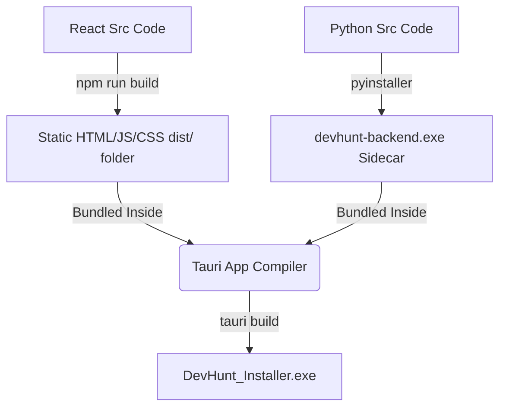

# 🖥️ DevHunt: Desktop Packaging & Frontend Modernization Guide

This document provides a detailed guide on:
1. How Tauri opens native windows (instead of default web browsers).
2. How to migrate the current vanilla HTML/CSS/JS frontend to a modern, component-based **React + Vite** architecture while keeping the Python Flask backend.
3. How Tauri packages the React frontend and Python backend together.

---

## 🧭 Part 1: Tauri App Window vs. System Web Browser

> **User Question**: *"Will it open the web browser automatically when the app opens?"*

**No, it will NOT open your default browser (like Chrome or Edge).**

Instead, Tauri opens a **native desktop application window**. 
*   **Desktop Look & Feel**: It runs inside a custom frame with its own title bar, minimize/maximize/close buttons, and custom application icon.
*   **No Browser Clutter**: There are no browser tabs, no URL address bars, and no default browser menus. It feels like a native desktop app (like Spotify, Discord, or VS Code).
*   **System WebView2 Integration**: Behind the scenes, it utilizes Windows' native Edge WebView2 engine to render the HTML/JS/CSS, but it operates independently of your actual Edge browser.

---

## 🛠️ Part 2: Migrating to a Component-Based Node Frontend (React + Vite)

Currently, your frontend consists of:
*   `index.html` (~118KB) — A massive layout file containing all UI structures.
*   `app.js` (~281KB) — A single script containing all state, API calls, SSE handlers, logs, settings, and workspace scripts.

To convert this into a structured, component-based **Node.js React + Vite** project without changing the Python backend code, we use the following setup:

### 1. New Folder Directory Structure

We will restructure the project to look like this:

```
DevHunt/
├── backend/                  # Python Flask backend API (no changes needed)
├── frontend-src/             # Node.js React + Vite project (New)
│   ├── package.json          # Node dependencies (react, lucide-react, etc.)
│   ├── vite.config.js        # Vite build & proxy settings
│   ├── index.html            # Vite entry HTML
│   └── src/                  # React Source Code
│       ├── main.jsx          # React app entry
│       ├── App.jsx           # Main page layout & state
│       ├── components/       # Component-based modular assets
│       │   ├── Sidebar.jsx   # Collapsible sidebar component
│       │   ├── Chat/         # Chat client (bubbles, streaming logic)
│       │   ├── QuestBoard/   # Kanban Todo board component
│       │   ├── IDE/          # Code editor, file explorer & terminal panel
│       │   ├── IntelVault/   # Document search, analyst split-screen
│       │   └── Arcade/       # Canvas arcade games component
│       └── styles/
│           └── themes.css    # Clean styling and CSS custom properties
└── src-tauri/                # Tauri Desktop configuration & Rust core
```

---

### 2. How React Talks to the Flask Backend

During development, we want everything to run smoothly. We use a **Vite Proxy** so that we don't have to write absolute URLs.

#### Vite Configuration (`frontend-src/vite.config.js`):
We configure Vite to route all API calls (`/api/...`) to the running Flask server (`http://localhost:1225`) automatically during development:

```javascript
import { defineConfig } from 'vite';
import react from '@vitejs/plugin-react';

export default defineConfig({
  plugins: [react()],
  server: {
    port: 5173,
    proxy: {
      '/api': {
        target: 'http://localhost:1225',
        changeOrigin: true,
        secure: false,
      }
    }
  }
});
```

#### Example React Component Code (`frontend-src/src/components/QuestBoard.jsx`):
You write modular components that perform clean fetch requests using relative paths:

```jsx
import React, { useState, useEffect } from 'react';

export default function QuestBoard() {
  const [todos, setTodos] = useState([]);

  useEffect(() => {
    // Relative API paths work out-of-the-box thanks to the dev proxy & Tauri setup
    fetch('/api/todos')
      .then(res => res.json())
      .then(data => {
        if (data.success) setTodos(data.todos);
      });
  }, []);

  return (
    <div className="quest-board">
      <h2>Quest Board</h2>
      <div className="kanban-columns">
        {/* Render columns and cards cleanly here */}
      </div>
    </div>
  );
}
```

---

## 🚀 Part 3: Tauri + React + Python Integration Pipeline

Here is how the packaging pipeline operates when bundling your component-based frontend and Python backend together:

### 1. Development Mode (Running locally for coding)
1.  **Start Flask**: Run Flask on `http://localhost:1225` (handles database and API endpoints).
2.  **Start Vite**: Run `npm run dev` in `frontend-src`. This launches the Vite server on `http://localhost:5173` with fast hot-reloading (changes in UI appear instantly).
3.  **Start Tauri Dev**: Run `npx tauri dev`. Tauri opens a native desktop window that points directly to the Vite server (`http://localhost:5173`).
    *   *Result*: The desktop window displays your UI, you edit React files, and the window updates instantly. The UI sends all `/api/` calls to Vite, which proxies them to Flask.

---

### 2. Production Build Mode (Creating the final `.exe` installer)
When you are ready to compile the desktop application:



1.  **Build React**: Run `npm run build` in `frontend-src`. This compiles your component code into a folder of static files inside `frontend-src/dist/`.
2.  **Compile Python**: Compile Flask using PyInstaller into `devhunt-backend-x86_64-pc-windows-msvc.exe` and place it in Tauri's binary sidecar folder.
3.  **Build Tauri**: Configure Tauri to read the compiled frontend files from `../frontend-src/dist` and point the window to load them locally. Run:
    ```powershell
    npx tauri build
    ```
4.  **Final Package**: Tauri takes the compiled React files, bundles them directly *into the desktop executable*, embeds the Python Flask executable as a background sidecar, and builds a standalone `DevHunt_Setup.exe` installer.

---

## 📋 Recommended Action Plan

To migrate your project to this architecture:

1.  **Initialize Node Project**: Set up a Vite React project in the `frontend-src/` directory.
2.  **Extract styling**: Move the color themes and layouts from `styles.css` into React styled modules or clean global stylesheets.
3.  **Break Down UI**: Split `index.html` and `app.js` into React components:
    *   `Sidebar` (for page toggling and theme configuration).
    *   `ChatEngine` (handles message input, SSE streams, markdown parsing, and memory updates).
    *   `QuestBoard` (renders Kanban columns, task creation cards, and priority selectors).
    *   `IDEWorkspace` (manages the editor layout, file explorer tree, and integrated terminal).
    *   `IntelVault` (controls PDF upload, web scraper input, and RAG document viewing).
    *   `Arcade` (canvas-based game runner).
4.  **Wire Up Tauri**: Initialize Tauri in the root directory and configure the Python backend sidecar.
